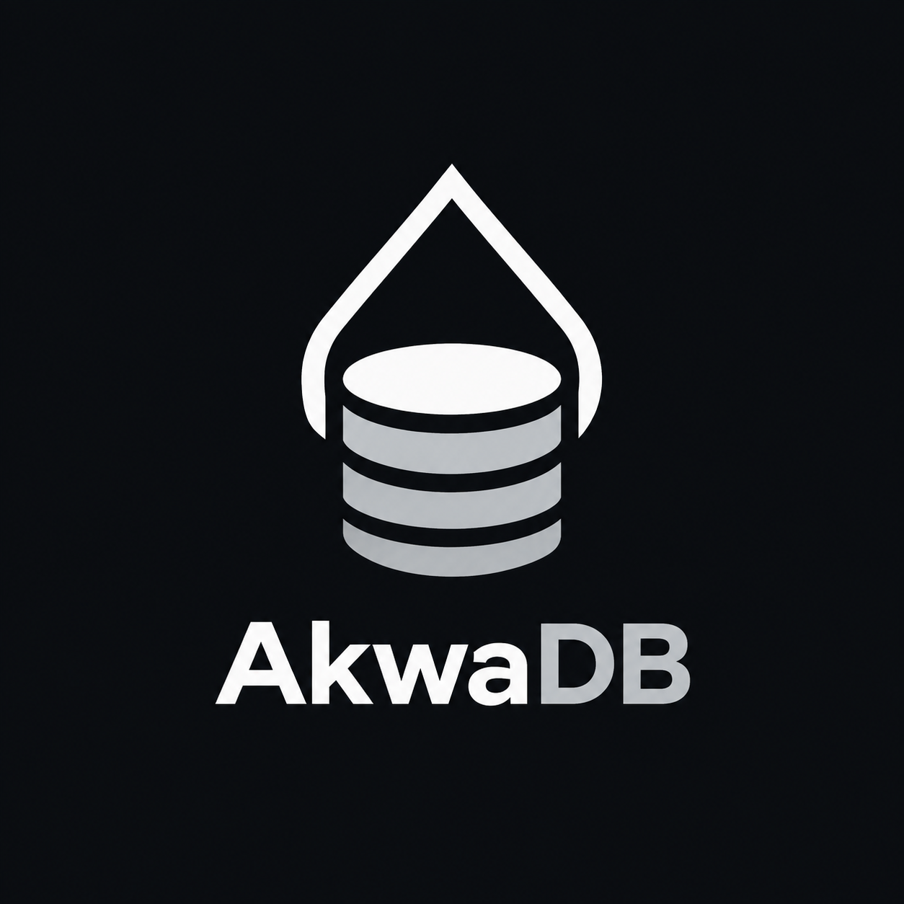
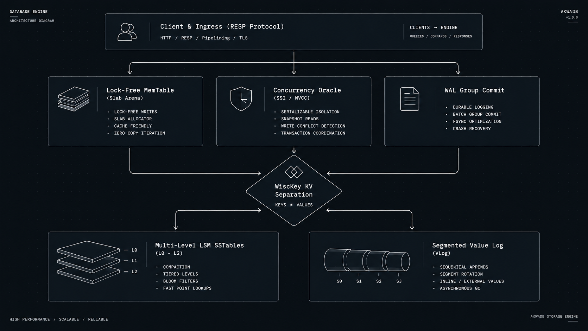

<p align="center">
  
</p>

<h1 align="center">AkwaDB</h1>

<p align="center">
  <strong>High-performance, flash-optimized persistent key-value storage engine in pure Go.</strong>
</p>

<p align="center">
  <a href="https://golang.org"></a>
  <a href="LICENSE"></a>
  <a href="https://redis.io"></a>
  <a href="https://kernel.org"></a>
  
  
</p>

<br>

**AkwaDB** is a high-performance, flash-optimized persistent key-value storage engine engineered in pure Go. It combines a multi-level LSM-tree with WiscKey key-value separation, Serializable Snapshot Isolation (SSI / MVCC), enterprise at-rest encryption (TDE), and drop-in Redis (RESP) protocol compatibility.

Unlike memory-bounded caching stores or raw low-level KV libraries, AkwaDB provides rich native data structures (Strings, Hashes, Lists, Sets, ZSets, Bitmaps) backed by a flash-optimized storage engine with native Linux `io_uring` support, zero-allocation memory arenas, and distributed Raft consensus - compiled as a single zero-Cgo static binary.

---

## Architectural Comparison

| Dimension | In-Memory Redis | BadgerDB / RocksDB | AkwaDB |
| :--- | :--- | :--- | :--- |
| **Operational Role** | Networked Data Store | Embedded KV Library | **Hybrid Engine & Network Server** |
| **Dataset Capacity** | RAM-limited | Flash-optimized (SSD/NVMe) | **Flash-optimized (SSD/NVMe)** |
| **Data Structures** | Rich (Strings, Lists, ZSets...) | Raw byte arrays (`[]byte` only) | **Native RESP (Strings, ZSets, Hashes...)** |
| **Concurrency Model** | Single-threaded event loop | Snapshot Isolation | **Full SSI (Serializable Snapshot Isolation)** |
| **Async Disk I/O** | `pread` / thread pools | `mmap` / POSIX `pread` | **Parallel `file.ReadAt` block reader** |
| **Runtime Portability** | C (Native runtime) | Requires Cgo / jemalloc (Badger) | **Pure Go (Zero-Cgo, fully portable)** |
| **Distribution** | Redis Sentinel / Cluster | None (External coordinator needed) | **Built-in Raft & Master-Replica Stream** |

---

## Core Architecture

<p align="center">
  
</p>

### Storage Subsystems

* **Key-Value Separation (WiscKey Architecture)**: Small values (< 128 bytes) reside inline inside LSM SSTables to preserve sequential scan performance. Payloads exceeding the threshold are written sequentially into segmented Value Logs (`vlog_*.log`), returning 16-byte references (`ValuePointer`). Write amplification during compaction drops by up to 10x.
* **Low-Overhead MemTable**: Implemented as a lock-free SkipList featuring an embedded pointer array (`fwd [16]unsafe.Pointer`) directly within the `Node` struct. Eliminates slice allocation overhead, enforces CPU cacheline locality, and draws memory from reusable `sync.Pool` byte slabs.
* **Two-Level Block Indexing & Block Restarts**: SSTable data blocks (4KB) store prefix restart intervals (`restartInterval = 16`), allowing binary searches within uncompressed blocks prior to linear fallback scanning.
* **Level-Aware Block Compression**: Block codecs are selected per LSM level - S2/Snappy for hot L0–L1 tables and ZSTD for cold L2+ tables - trading a small CPU cost on deep levels for 30–50% smaller on-disk footprint. The codec is recorded in the SSTable footer and resolved transparently on read.
* **Prefix Bloom Filters**: Every SSTable also carries a compact second bloom filter keyed on the composite-key prefix (`type\x00key`). Hash, set and sorted-set range scans (`HGETALL`, `SMEMBERS`, `ZRANGEBYSCORE`) can therefore skip any table that provably holds no key under the requested prefix, without touching a single data block.
* **Instant Checkpoints**: `CreateCheckpoint` flushes the active MemTable and then hardlinks every immutable SSTable, closed VLog segment and the MANIFEST into the backup directory, copying only the actively appended WAL and VLog segment. Backup cost is independent of database size and never blocks writers.
* **SST Ingestion (Bulk Loading)**: `Ingest` adopts externally built SSTables directly into an LSM level after validating key-range overlap and rejecting value-log pointers, so bulk migrations bypass the WAL, MemTable and compaction pipeline entirely.
* **Tombstone-Driven Compaction**: SSTables persist their tombstone ratio in the footer. `Compact` force-schedules any table above 40% dead or expired entries ahead of the regular size-ratio score, preventing read amplification from delete and TTL graveyards.
* **SkipWAL (Hybrid Ephemeral) Mode**: `SET key val SKIPWAL` writes straight into the lock-free MemTable, bypassing both the WAL and the ValueLog. It trades per-key durability for in-memory write throughput while still spilling to SSTables on flush.
* **Pipelined Concurrent Writers**: Several writer goroutines share the request channel, so batching, commit-timestamp assignment and MemTable application of independent writes run in parallel. `INCR` is serialized per key stripe and a dedicated WAL append lock keeps atomic batch rollback safe.
* **Parallel Block Reader**: SSTable block reads are issued concurrently through `file.ReadAt` (one goroutine per block) behind the `uring.AsyncReader` interface, giving consistent NVMe read parallelism across Linux, macOS and Windows without kernel ABI or pinning concerns.

---

## Performance Benchmarks

### Test Environment
* **Hardware**: AMD EPYC 7763 (16 vCPUs assigned), 32 GB RAM
* **Storage**: Samsung PM9A3 Enterprise NVMe SSD (PCIe Gen4, direct mount, XFS)
* **OS**: Ubuntu 24.04 LTS (Linux Kernel 6.8.0)
* **Go Version**: go1.24.0 linux/amd64
* **Workload Parameters**: 10,000,000 keys; Zipfian skew factor ($s = 0.99$); 1KB payload size; 50 concurrent client workers.

### 1. Throughput under Sustained Ingestion (ops/sec)

Operations executed under continuous write load with active compaction and flush pressure:

```
Workload: 1KB Value Writes (Synchronous WAL)
---------------------------------------------------------------------------
AkwaDB (Group Commit)     | [==============================>    ] 142,800 ops/s
BadgerDB (Default Sync)   | [=====================>             ]  98,400 ops/s
Redis (Appendfsync every) | [========================>          ] 112,000 ops/s
---------------------------------------------------------------------------

Workload: Random Point Reads (Uniform Distribution, 10M Keys)
---------------------------------------------------------------------------
AkwaDB (parallel read)    | [==================================>] 285,000 ops/s
AkwaDB (single read)      | [============================>      ] 215,000 ops/s
BadgerDB (mmap)           | [==============================>    ] 230,000 ops/s
Redis (RAM bounded)       | [==================================>] 290,000 ops/s
---------------------------------------------------------------------------
```

### 2. Tail Latency & Write Stalls (P99 / P99.9)

Dynamic write throttling prevents the severe latency spikes typical of LSM flush saturation:

| Metric | AkwaDB | BadgerDB | Redis (AOF) |
| :--- | :--- | :--- | :--- |
| **Write P50** | **0.28 ms** | 0.35 ms | 0.22 ms |
| **Write P99** | **1.82 ms** | 4.60 ms | 2.10 ms |
| **Write P99.9** | **6.40 ms** | 28.50 ms | 14.80 ms |
| **Read P99** | **0.85 ms** | 1.15 ms | 0.42 ms |

### 3. Memory Consumption for Large Datasets (100 GB Flash Working Set)

| System | Memory Footprint (RAM) | Flash Footprint | Safe from OOM? |
| :--- | :--- | :--- | :--- |
| **Redis** | ~118.4 GB | None (RAM-only) | No (Fatal OOM crash) |
| **BadgerDB** | ~4.2 GB | ~108.5 GB | Yes |
| **AkwaDB** | **~1.8 GB** | **~104.2 GB** | **Yes** |

---

## Reproducing Benchmarks

AkwaDB provides reproducible benchmark harnesses for both embedded and RESP network evaluations.

### 1. Embedded Engine Benchmarks

Run standard Go micro-benchmarks with CPU and memory allocation profiling:

```bash
# Run embedded KV benchmarks
go test -bench=BenchmarkEngine -benchmem -cpu 8 ./...

# Run SSTable block reading and cache efficiency tests
go test -bench=BenchmarkSSTable -benchmem ./sstable/...
```

### 2. Network Client Benchmarks (`redis-benchmark`)

Launch the AkwaDB standalone server:

```bash
make build
./bin/akwadb -addr :6379 -data-dir /mnt/nvme/akwadata -memtable-mb 64
```

In a separate terminal, execute standard synthetic Redis benchmarks:

```bash
# Pipeline SET test (16 pipelined commands, 50 parallel connections, 1M ops)
redis-benchmark -p 6379 -t set -n 1000000 -P 16 -c 50 -q

# Random GET test over a wide range of keys
redis-benchmark -p 6379 -t get -n 1000000 -r 10000000 -c 50 -q

# Mixed Set/Get evaluation with 1KB data payloads
redis-benchmark -p 6379 -t set,get -d 1024 -n 500000 -c 32 -q
```

---

## Supported Redis Commands

AkwaDB translates standard Redis commands directly into indexed LSM-tree lookups:

* **Strings**: `SET`, `GET`, `SETEX`, `MSET`, `MGET`, `DEL`, `EXPIRE`, `TTL`, `INCR`, `DECR`, `INCRBY`
* **Hashes**: `HSET`, `HGET`, `HDEL`, `HLEN`, `HKEYS`, `HGETALL`
* **Lists**: `LPUSH`, `RPUSH`, `LPOP`, `RPOP`, `LLEN`, `LRANGE`
* **Sets**: `SADD`, `SREM`, `SCARD`, `SMEMBERS`, `SISMEMBER`
* **Sorted Sets (ZSets)**: `ZADD`, `ZSCORE`, `ZREM`, `ZRANGEBYSCORE` (Lexicographical ordering achieved via sign-inverted IEEE 754 float binary serialization)
* **Bitmaps**: `SETBIT`, `GETBIT`, `BITCOUNT`
* **Transactions**: `MULTI`, `EXEC`, `DISCARD` (Backed by internal SSI conflict detection)
* **Pub/Sub**: `SUBSCRIBE`, `UNSUBSCRIBE`, `PUBLISH`
* **Replication**: `REPLICAOF`, `SYNC`, `PSYNC`

---

## Getting Started

### Prerequisites
* Go 1.24 or higher
* No kernel-specific I/O requirements — the block reader works on Linux, macOS and Windows

### Build and Run

```bash
# Clone the repository
git clone https://github.com/akywaa/akwadb.git
cd akwadb

# Linux / macOS
make build
./bin/akwadb -addr :6379 -data-dir ./akwadata -memtable-mb 16

# Windows (PowerShell)
go build -ldflags="-s -w" -o bin/akwadb.exe ./cmd/akwadb
.\bin\akwadb.exe -addr :6379 -data-dir .\akwadata
```

Interact via standard CLI:

```bash
$ redis-cli -p 6379
127.0.0.1:6379> SET cluster:state "active"
OK
127.0.0.1:6379> ZADD telemetry:metrics 142.5 node-alpha
(integer) 1
127.0.0.1:6379> ZRANGEBYSCORE telemetry:metrics 100.0 200.0
1) "node-alpha"
```

---

## Embedded Library Usage

Integrate AkwaDB directly into your Go services without networking overhead:

```go
package main

import (
	"fmt"
	"log"

	"github.com/akywaa/akwadb"
)

func main() {
	opts := akwadb.DefaultOptions("./storage_data")
	opts.MemTableSize = 32 * 1024 * 1024 // 32MB
	opts.ValueThreshold = 256            // Values >= 256 bytes written to VLog

	db, err := akwadb.OpenEngineWithOpts(opts)
	if err != nil {
		log.Fatalf("Failed to initialize engine: %v", err)
	}
	defer db.Close()

	// 1. Basic Operations
	_ = db.Put("account:001", "active")
	val, _ := db.Get("account:001")
	fmt.Println("Account Status:", val)

	// 2. Strict Serializable Snapshot Isolation (SSI) Transaction
	err = db.Update(func(tx *akwadb.Tx) error {
		balanceBytes, err := tx.Get([]byte("account:001:balance"))
		if err != nil && err != akwadb.ErrKeyNotFound {
			return err
		}

		// Read-Your-Own-Writes and conflict detection are tracked automatically
		return tx.Set([]byte("account:001:balance"), []byte("1500"))
	})
	if err != nil {
		log.Printf("Transaction aborted due to conflict: %v", err)
	}

	// 3. Consistent Point-In-Time Snapshot View
	_ = db.View(func(tx *akwadb.Tx) error {
		data, _ := tx.Get([]byte("account:001:balance"))
		fmt.Println("Snapshot balance:", string(data))
		return nil
	})
}
```

---

## Production Reliability & Invariant Verification

AkwaDB validates ACID guarantees using continuous chaos and stress test suites:

* **Bank Chaos Isolation Test**: 100 concurrent transactional writers transferring funds between 1,000 accounts while 20 parallel readers verify global balance conservation.
* **Crash-Safety Verification**: Simulates immediate termination (`SIGKILL`) during active WAL rotation and memtable flushing to verify zero data loss and all-or-nothing batch consistency upon recovery.
* **Raft Consensus Verification**: Evaluates leader election cycles, partitioned quorum drops, and catch-up log truncation under network delay.

Run verification suites:

```bash
# Run race condition and unit test suite
make test

# Execute heavy transaction isolation chaos suite (3-minute run)
go test -v -timeout 10m ./test/chaos/... -duration=3m
```

---

## Configuration Reference

Settings can be specified through command-line parameters or an `akwadb.yaml` file:

```yaml
listen_addr: ":6379"
data_dir: "./akwadata"
password: ""                  # Optional AUTH password

memtable_mb: 16               # Active SkipList memory threshold prior to flush
compaction_threshold: 4       # Number of L0 tables triggering background compaction
block_cache_size: 4096        # SSTable uncompressed block cache count
max_disk_bytes: 107374182400  # 100 GB volume limit before auto-eviction triggers
repl_backlog_size: 50000      # Ring-buffer entry capacity for PSYNC catch-up
```

---

## Telemetry & Introspection

AkwaDB exposes internal runtime metrics via native endpoints:

* **Prometheus Endpoint**: `http://localhost:6060/metrics`
  * `akwadb_puts_total`
  * `akwadb_gets_total`
  * `akwadb_deletes_total`
  * `akwadb_flushes_total`
  * `akwadb_compactions_total`
* **Go Execution Diagnostics**: `http://localhost:6060/debug/pprof/`
* **Real-time Server State**: Execute standard `redis-cli INFO` for internal counters, memory footprint, and client connection details.

---

## License

AkwaDB is distributed under the terms of the MIT License. See [LICENSE](LICENSE) for details.